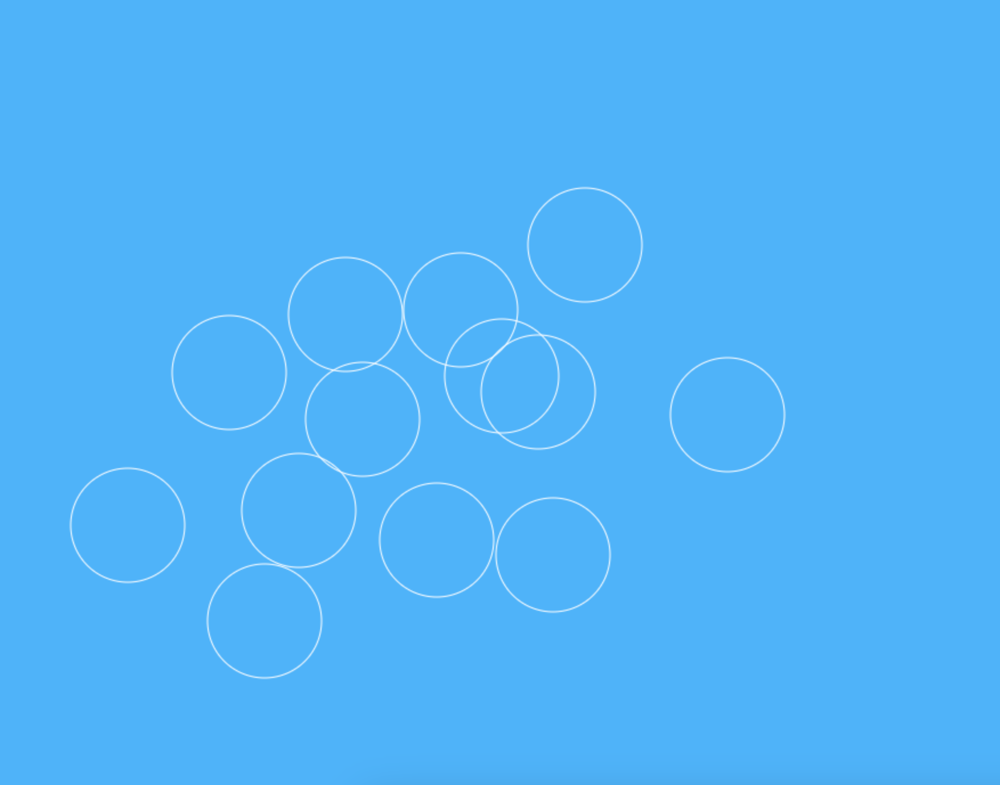
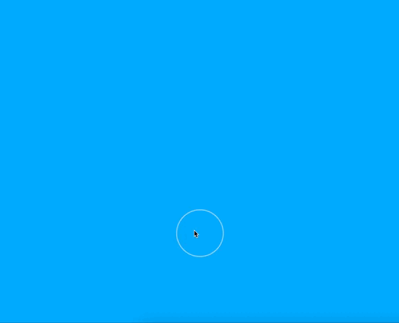

# Animated bubbles with HTML5, JavaScript and Canvas

## Description
Creating animated bubbles without css, using HTML and a JS.

## Getting started


## Live demo Project


## Development guide

### Start using canvas and canvas context
- Add a click listener to the canvas, and capture the x and y coordinates;
- Use the context to start a path `context.beginPath()`
- Use the context to call arc method with the coordinates (the center of the circle), a radius and a start angle and end angle, that will be `0` and `2* Math.PI`.

```js
  context.arc(x, y, 50, 0, 2* Math.PI);
```
- Set up the stroke to white using `strokeStyle` and call `stroke` method.
```js
  context.strokeStyle = "white";
  context.stroke();
```


### Animating the bubbles using `requestAnimationFrame`

- Now we add a move function to update the x, y bubbles coordinates:
```js
function move() {
  const dx = Math.random() * 3;
  const dy = Math.random() * 7;

  x = x + dx;
  y = y - dy;
}
```
- And then we add an `animate` function that clear the canvas context.
- We call the move function and the `drawCircle`
- We showld call the `requestAnimationFrame(animate)` passing the animate.
- At least we should call `animate()` outside.

```js
const animate = () => {
  context.clearRect(0, 0, canvas.width, canvas.height);

  move();
    drawCircle(x,y);

  requestAnimationFrame(animate);
};

animate();
```



## Tecnologies
HTML5 | JavaScript | CSS


Inspired by [How to create animated bubbles with html5 canvas and javascript](https://www.freecodecamp.org/news/how-to-create-animated-bubbles-with-html5-canvas-and-javascript/) - at [Freecodecamp](https://www.freecodecamp.org/)